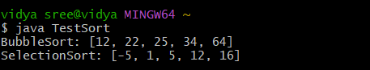

# java-lab-cse-g-5ef-5a
# experiment-5a
## implementation of interface 
source code 
```
import java.util.Arrays;

interface Sortable {
    void sort(int[] arr);
}

class BubbleSort implements Sortable {
    public void sort(int[] arr) {
        for (int i = 0; i < arr.length - 1; i++)
            for (int j = 0; j < arr.length - i - 1; j++)
                if (arr[j] > arr[j + 1]) {
                    int temp = arr[j];
                    arr[j] = arr[j + 1];
                    arr[j + 1] = temp;
                }
    }
}

class SelectionSort implements Sortable {
    public void sort(int[] arr) {
        for (int i = 0; i < arr.length - 1; i++) {
            int min = i;
            for (int j = i + 1; j < arr.length; j++)
                if (arr[j] < arr[min]) min = j;
            int temp = arr[min];
            arr[min] = arr[i];
            arr[i] = temp;
        }
    }
}

import java.util.Arrays;

public class TestSort {
    public static void main(String[] args) {
        Sortable ref;
        int[] a1 = {64, 34, 25, 12, 22};
        int[] a2 = {5, 1, 12, -5, 16};

        ref = new BubbleSort();
        ref.sort(a1);
        System.out.println("BubbleSort: " + Arrays.toString(a1));

        ref = new SelectionSort();
        ref.sort(a2);
        System.out.println("SelectionSort: " + Arrays.toString(a2));
    }
}
```


##  OUTPUT:



